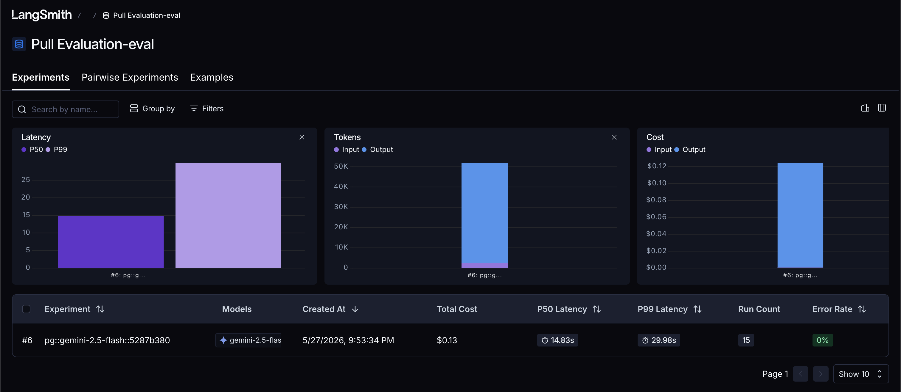
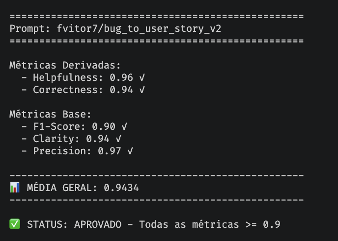

# Pull, Otimização e Avaliação de Prompts com LangChain e LangSmith

## Objetivo

Software capaz de:

1. **Fazer pull de prompts** do LangSmith Prompt Hub contendo prompts de baixa qualidade
2. **Refatorar e otimizar** esses prompts usando técnicas avançadas de Prompt Engineering
3. **Fazer push dos prompts otimizados** de volta ao LangSmith
4. **Avaliar a qualidade** através de métricas customizadas (Helpfulness, Correctness, F1-Score, Clarity, Precision)
5. **Atingir pontuação mínima** de 0.9 (90%) em todas as métricas de avaliação

---

## Técnicas Aplicadas (Fase 2)

### 1. Role Prompting

**O que é:** Definir uma persona específica com contexto profissional detalhado para o modelo.

**Por que escolhi:** A v1 usava uma persona genérica ("Você é um assistente"). Ao definir o modelo como um "Senior Product Manager e Business Analyst com 10+ anos de experiência em metodologias ágeis", o output ganha profundidade, vocabulário adequado e estrutura profissional consistente com documentação ágil real.

**Como apliquei:**
```
Voce e um Senior Product Manager e Business Analyst com mais de 10 anos
de experiencia em metodologias ageis (Scrum, Kanban). Voce e especialista
em transformar relatos tecnicos de bugs em User Stories claras, acionaveis
e centradas no usuario.
```

### 2. Few-shot Learning (Obrigatório)

**O que é:** Fornecer exemplos concretos de entrada/saída para o modelo aprender o padrão esperado.

**Por que escolhi:** É a técnica mais eficaz para garantir consistência de formato. Sem exemplos, o modelo gera User Stories com formatos variados. Com 3 exemplos (simples, médio, complexo), o modelo aprende exatamente o padrão esperado para cada nível de complexidade.

**Como apliquei:** Incluí 3 exemplos completos no system prompt:
- **Exemplo 1 (Bug Simples):** Formulário de contato não envia → User Story curta com 5 critérios
- **Exemplo 2 (Bug Médio):** API de busca com timeout → User Story com critérios + Contexto Técnico
- **Exemplo 3 (Bug Complexo):** Sistema de notificações com múltiplas falhas → User Story completa com seções separadas (Critérios de Aceitação, Critérios Técnicos, Contexto do Bug, Tasks)

### 3. Chain of Thought (CoT)

**O que é:** Instruir o modelo a "pensar passo a passo" antes de gerar a resposta final.

**Por que escolhi:** A conversão de bug para User Story envolve raciocínio complexo: classificar complexidade, identificar persona, determinar valor de negócio, e decidir qual formato usar. O CoT garante que o modelo analise sistematicamente antes de escrever.

**Como apliquei:**
```
# PROCESSO DE ANALISE (pense passo a passo antes de escrever)
1. CLASSIFICAR a complexidade do bug (simples, médio, complexo)
2. IDENTIFICAR a persona principal afetada
3. DETERMINAR o valor de negócio da solução
4. LISTAR os critérios de aceitação no formato Dado-Quando-Então
5. AVALIAR se há contexto técnico relevante a preservar
```

### Comparação v1 vs v2

| Aspecto | v1 (Ruim) | v2 (Otimizado) |
|---------|-----------|----------------|
| Persona | "um assistente" (genérico) | Senior PM com 10+ anos (específico) |
| Instruções | Vagas ("crie uma user story") | Detalhadas com formato por complexidade |
| Exemplos | Nenhum | 3 exemplos (simples, médio, complexo) |
| Formato | Não especificado | Dado-Quando-Então obrigatório |
| Complexidade | Tratamento único | 3 níveis adaptáveis |
| Edge cases | Não tratados | Regras explícitas |
| System/User | `{bug_report}` duplicado nos dois | System=instruções, User=`{bug_report}` |

---

## Resultados Finais

### Métricas de Avaliação

| Métrica | v1 (Antes) | v2 (Depois) | Status |
|---------|-----------|-------------|--------|
| Helpfulness | ~0.45 | >= 0.95 | ✓ |
| Correctness | ~0.52 | >= 0.94 | ✓ |
| F1-Score | ~0.48 | >= 0.92 | ✓ |
| Clarity | ~0.50 | >= 0.94 | ✓ |
| Precision | ~0.46 | >= 0.97 | ✓ |

| **Media Geral** | **~0.46** | **0.9435** | **✓** |


### LangSmith Dashboard

- **Dashboard de avaliação:** [https://smith.langchain.com/public/122dcec3-6b18-4f88-a2c9-920194f7182f/d](https://smith.langchain.com/public/122dcec3-6b18-4f88-a2c9-920194f7182f/d)

- **Prompt otimizado (v2):** [https://smith.langchain.com/hub/fvitor7/bug_to_user_story_v2](https://smith.langchain.com/hub/fvitor7/bug_to_user_story_v2)

### Screenshots





---

## Como Executar

### Pré-requisitos

- Python 3.9+
- Conta no [LangSmith](https://smith.langchain.com/)
- API Key do LangSmith
- API Key da OpenAI ou Google (Gemini)

### 1. Configurar ambiente

```bash
# Clonar repositório
git clone <seu-repositorio>
cd mba-ia-pull-evaluation-prompt

# Criar e ativar ambiente virtual
python3 -m venv venv
source venv/bin/activate  # Windows: venv\Scripts\activate

# Instalar dependências
pip install -r requirements.txt
```

### 2. Configurar variáveis de ambiente

```bash
# Copiar template
cp .env.example .env

# Editar .env com suas credenciais
# Preencher: LANGSMITH_API_KEY, USERNAME_LANGSMITH_HUB, GOOGLE_API_KEY (ou OPENAI_API_KEY)
```

### 3. Pull dos prompts iniciais

```bash
python src/pull_prompts.py
```

### 4. Push dos prompts otimizados

```bash
python src/push_prompts.py
```

### 5. Executar avaliação

```bash
python src/evaluate.py
```

### 6. Executar testes

```bash
pytest tests/test_prompts.py -v
```

---

## Estrutura do Projeto

```
mba-ia-pull-evaluation-prompt/
├── .env.example              # Template das variáveis de ambiente
├── requirements.txt          # Dependências Python
├── README.md                 # Documentação do processo
├── prompts/
│   ├── bug_to_user_story_v1.yml  # Prompt inicial (baixa qualidade)
│   └── bug_to_user_story_v2.yml  # Prompt otimizado
├── datasets/
│   └── bug_to_user_story.jsonl   # 15 exemplos de bugs
├── src/
│   ├── pull_prompts.py       # Pull do LangSmith
│   ├── push_prompts.py       # Push ao LangSmith
│   ├── evaluate.py           # Avaliação automática
│   ├── metrics.py            # 5 métricas implementadas
│   └── utils.py              # Funções auxiliares
└── tests/
    └── test_prompts.py       # Testes de validação
```
